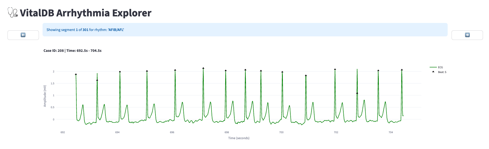
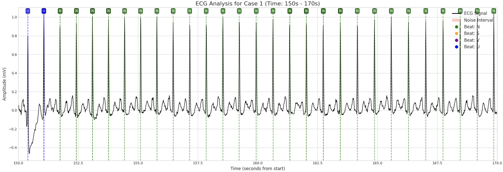

# VitalDB-Arrhythmia-Database

The **VitalDB Arrhythmia Database** is a comprehensive collection of annotated intraoperative electrocardiogram (ECG) data derived from surgical patient monitoring. This database has been made publicly accessible to facilitate the development of robust arrhythmia detection algorithms tailored to the unique challenges of the surgical environment.

## 📈 About the Database

This database contains 734,528 seconds of continuous ECG recordings from 482 patients undergoing non-cardiac surgery. It includes over 660,000 beat and rhythm annotations that were manually reviewed and validated by five anesthesiologists.

**Key Features:**
- **Scale**: Data from 482 patients, totaling 734,528 seconds of ECG recordings.
- **Detailed Annotations**: Contains 661,894 validated heartbeats.
- **Rhythm Categories**: Features 10 distinct rhythm labels:
  1. Atrial Fibrillation/Flutter
  2. Atrioventricular (AV) Block
  3. Normal Sinus Rhythm
  4. Sinus Node Dysfunction
  5. Patterned Atrial Ectopy
  6. Patterned Ventricular Ectopy
  7. Supraventricular Tachyarrhythmia
  8. Ventricular Tachycardia
  9. Wandering Atrial Pacemaker / Multifocal Atrial Tachycardia
  10. Unclassifiable

## 📂 Data Structure
The database consists of a main **metadata file** and individual **annotation files** for each case.

1.  **`metadata.csv`**: This file provides a summary for each case record.
      * `case_id`: A unique identifier for the case.
      * `analysis_start_time_sec` / `analysis_end_time_sec`: The timestamp of the first and last annotated beat in seconds.
      * `analyzed_duration_sec`: The total duration of the analyzed portion of the recording in seconds.
      * `total_beats`: The total number of heartbeats in the annotation file.
      * `rhythm_classes`: A list of all unique rhythm labels present in the file.

2.  **Annotation Files (`Annotation_file_[case_id].csv`)**: Each case has a corresponding CSV file containing detailed beat and rhythm annotations.
      * `time_second`: The timestamp of the R-peak in seconds from the start of the recording.
      * `beat_type`: The classification for the individual heartbeat (e.g., N, S, V, U).
      * `rhythm_label`: The overall heart rhythm label for the segment where the beat occurs.
      * `bad_signal_quality`: A boolean flag (True/False) indicating if the beat is within a segment of poor signal quality.

## 🚀 Getting Started

### 1\. Using the Web Viewer

A web viewer is provided for visual exploration of the data. You can run it with the following command:

```bash
streamlit run webviewer.py
```

**Web Viewer Interface:**



### 2\. Python Tutorial
For instructions on how to load and analyze the data directly using Python, please refer to the Jupyter Notebook tutorial below:
  ***`UsageNote.ipynb`**

  ***`Vital_beat_noise_detection.ipynb`***

      * This notebook demonstrates a complete workflow for arrhythmia analysis using the `pyvital` library. It shows how to:
        1.  Load a `VitalFile` for a specific case.
        2.  Run a custom filter that performs both beat classification and rule-based noise detection.
        3.  Visualize the analysis results, including beat labels and noise intervals, on the ECG waveform.



## 📄 Citation
If you use this database in your research, please cite the following paper:
> Da-In Eun, Kayoung Shim, Lee Hyunsoo, et al. (2025). *VitalDB Arrhythmia Database: Publicly accessible real-world intraoperative electrocardiogram database with beat and rhythm annotations*.

## ⚖️ License
This project is licensed under the MIT License. Please see the `LICENSE` file for details.
